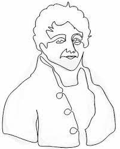
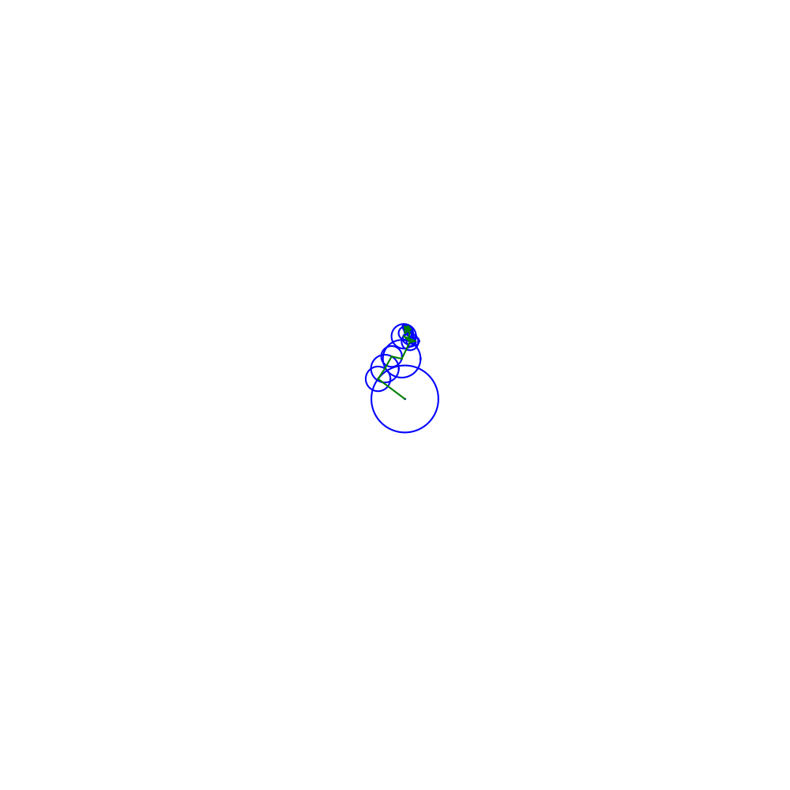

# Fourier Series Drawing Animation

This project demonstrates how to use Fourier series to create an animation of a drawing based on the contours of an image. The main code reads an image, extracts its contours, calculates the Fourier coefficients, and then animates the drawing process using these coefficients.

## Prerequisites

Make sure you have the following libraries installed:
- `cv2` (OpenCV)
- `numpy`
- `matplotlib`
- `sympy`

## Files

- `main.py`: Main code file that performs the Fourier series animation.
- `file.gif`: Output GIF file showing the Fourier series animation.
- `drawing.py`: To Draw the image or figure manually.

## Images

### Input Image

### Output Animation

## Functions

- **read_img()**: Reads the image from the file system and returns it as a NumPy array.
- **c_n(list_x, list_y, n)**: Computes the coefficient \(c_n\) for a specific frequency component \(n\).
- **get_coeffs(list_x, list_y, N)**: Calculates the Fourier coefficients for the given x and y coordinate lists.
- **get_coordinates(img)**: Extracts the x and y coordinates of the largest contour in the input image.
- **get_circle_coords(center, r, N=50)**: Returns the coordinates of a circle with a given center and radius.
- **get_next_pos(c, fr, t, drawing_time=1)**: Computes the rotated vector \(c_n\) at time \(t\) and frequency \(fr\).
- **show_image(img)**: Displays the image in a window until the 'Esc' key is pressed (mainly for debugging).
- **print_eqn()**: Prints the Fourier series equation in a format suitable for plotting on Desmos.
- **see_animation()**: Creates and saves an animation of the drawing process using the computed Fourier coefficients.

## Main Execution Flow

1. The script starts by reading the input image.
2. It then extracts the largest contour from the image and calculates the Fourier coefficients.
3. Finally, it animates the drawing process using these coefficients and saves the animation as a GIF.

## Acknowledgments

- The project uses Fourier series to create a unique visualization of image contours.
- Thanks to the authors of the `cv2`, `numpy`, `matplotlib`, and `sympy` libraries for making such powerful tools available.

Feel free to contribute to this project by submitting issues or pull requests. Enjoy exploring Fourier series and creating amazing visualizations!

